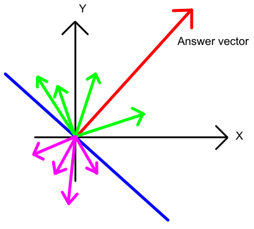
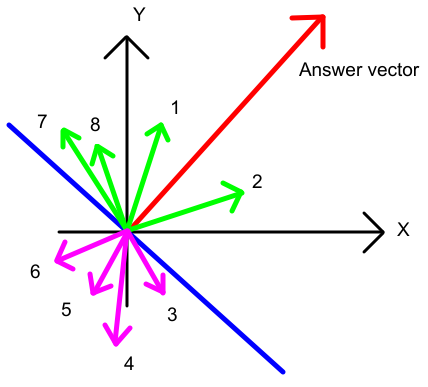

## 火箭测试 题解

出题人： 成子谦

### 出题idea

这道题是我在打某场atcoder beginner contest时见到的，原题数据范围比较小，但有较高的精度要求。为了让题目不那么恶心，就改为输出距离的平方，~~让大家开心一下。~~

### 解法

原题可以抽象为如下数学问题：

> 给定一个向量集$S$，选取它的一个子集$S'$并对$S'$中的所有向量求和，使得最终得到的答案向量的模长尽可能大。

有过oi经验的人可能会第一时间想到搜索，这是一个好的想法。这样的做法必然要对向量进行若干次遍历，时间复杂度为$O(Cn)$，$C$为一常数。但往哪个方向搜索、如何搜索，做法因人而异。如果考虑得不够精细，很可能会写挂掉，这里不再赘述。

不妨换一个思路，掏出你们的草稿纸并作如下思考：既然我们不知道如何选择向量使得答案向量的模长尽量长，那么我们可以假定一个**新的很长的向量**作为答案向量，并考察该向量和原有向量的关系。

如上图，绿色向量和紫色向量是题目给定的向量，红色向量是我们假定的答案向量。在题目给定的向量中，哪些向量有可能用于组成答案向量呢？如果还不确定，过原点作一条与答案向量垂直的直线(图中蓝色线)，这个问题是不是清晰多了？

显然，图中绿色向量都有助于构造答案向量，因为它们与答案向量的点积$\gt0$(或者换个说法，它们与答案向量的夹角小于$90°$)，这个东西相信大家在线性代数都学过了吧\^_\^。可以得到结论：与最终答案向量夹角小于$90°$的向量必然有助于构造答案(用ACM术语来说，就是对答案有“贡献”)。

现在，问题转化成：

> 如何找到所有与答案向量夹角小于90°的向量？

可能很多同学还是一头雾水，不知道这个问题该如何解决，但我们可以留意到一个事实：对答案有贡献的向量(即上图中的绿色向量)必然是**挨在一起**的，不会出现“有单个绿色向量夹在紫色向量中”这样的情况。所以可以马上意识到：**应该要对所有向量按照斜率排序(比如按照向量与x正半轴的夹角排序)，让方向相近的向量在数组中相邻排列，才能继续做下去**。很好，这一步是对的！但我们仍然不知道答案向量在哪。也许有同学会建议：既然我不知道答案向量在哪，那我就把向量集$S$的所有子集$S'$都枚举一遍，计算$d^2$可能的最大值。这是一个很好的想法。我们继续用上面的图来给大家展示如何枚举向量集$S$的子集$S'$：

如上图，我们把8个向量按一定顺序编号。从第一个向量开始枚举每个向量，作为本次扫描的起点，我们总共要对所有向量进行$n$次扫描(别忘了$n$是向量个数，至于是顺时针扫描还是逆时针扫描无所谓，这里我们以顺时针为例）。当我们从第1个向量开始扫描时，扫完前两个向量之后就会遇到编号为3的紫色向量，看上去无法计算出正确答案。但当我们从第7个向量开始扫描时，扫完前4个向量就会发现：所有的绿色向量都被我们考虑到，此时我们所得到的$d^2$即为正解。

在上述过程中，每当我们扫描到一个新的向量，只需计算当前所得$d^2$并与之前所得的$d^2$进行比较，维护一个最大值，这样所得到的$d^2$一定就是答案。故我们得到如下算法：先对所有向量按斜率排序，再枚举每个向量作为起点，按斜率顺序遍历一次**所有向量**，维护$d^2$的最大值即可。该枚举算法的时间复杂度为$O(nlogn+n^2)$。

从时间复杂度来看，这并不是一个最优的做法，但它能保证算法的正确性，而且实现方法非常简单。由于~~这是新生杯啊，怎么能残害祖国的花朵，所以~~n非常小$(1 \le n \le 1000)$，$O(n^2)$的做法是完全可以接受的。~~毕竟看数据范围做题也是ACM的一部分。~~如果有同学用玄学搜索AC了这题，出题人表示~~您真牛逼~~非常欣慰XD。

本题极限数据的答案为$2*(1e^3*1e^6)^2=2e^{18}$，故只需开long long即可，具体实现请看标程。

P.S：这道题有没有其他更好的做法呢？那当然是有的，比如用滑动窗口(尺取法)可以做到$O(nlogn)$的优秀复杂度，实现难度也有所上升，大家可以尝试一下～